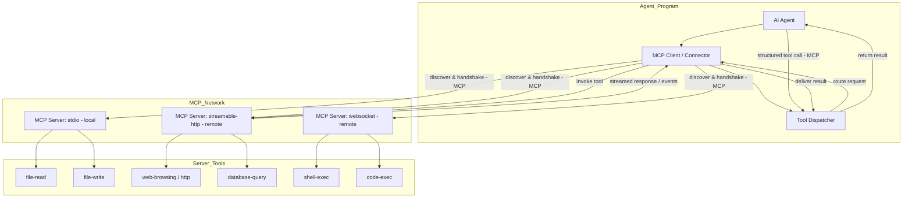

---
# try also 'default' to start simple
theme: seriph
# random image from a curated Unsplash collection by Anthony
# like them? see https://unsplash.com/collections/94734566/slidev
#background: https://images.unsplash.com/photo-1620837953336-8274c0623a3c?q=80&w=1470&auto=format&fit=crop&ixlib=rb-4.1.0&ixid=M3wxMjA3fDB8MHxwaG90by1wYWdlfHx8fGVufDB8fHx8fA%3D%3D
background: background.png
# some information about your slides (markdown enabled)
title: AIDD - AI Driven Development Course - Intro
info: |
  ## 01 - Intro to AIDD
  Presentation of the introduction to AI Driven Development (AIDD) course.
  Presented by [José F. Rives](https://github.com/digiogithub) at [Digio](https://digio.es)

  Learn more at [AIDD](https://madeindigio.github.io/aidd/)
# apply UnoCSS classes to the current slide
class: text-center
# https://sli.dev/features/drawing
drawings:
  persist: false
# slide transition: https://sli.dev/guide/animations.html#slide-transitions
transition: slide-left
# enable MDC Syntax: https://sli.dev/features/mdc
mdc: true
---

# Introducción a AIDD

Desarrollo guiado por IA

JFRives · digio · 2025

<!--
Flujos de desarrollos modernos potenciados por IA que se están utilizando en 2025 para el desarrollo del software, equipos como MS, Google, Amazon, Salesforce y muchas otras empresas están adoptando estos flujos de trabajo para mejorar la productividad y la calidad del software.
-->

---
transition: fade-out
---

# Qué es AIDD?


AIDD (AI Driven Development) es un enfoque de desarrollo de software que utiliza inteligencia artificial para mejorar la productividad y la calidad del software. 

AIDD se basa en tres pilares fundamentales:

1. **Automatización**: *AIDD permite automatizar tareas repetitivas y tediosas, lo que reduce la carga de trabajo de los desarrolladores y les permite centrarse en tareas más creativas y de mayor valor. Generación de documentación, pruebas unitarias, análisis de código, etc.*

2. **Generación de código**: *AIDD utiliza modelos de lenguaje natural para generar código de manera automática, lo que acelera el proceso de desarrollo y reduce la posibilidad de errores.* 

3. **Asistencia en la toma de decisiones**: *AIDD proporciona a los desarrolladores información y recomendaciones basadas en datos para ayudarles a tomar decisiones más informadas y mejorar la calidad del software. Capaz de realizar análisis de grandes cantidades de información y proporcionar recomendaciones basadas en datos, revisar implementaciones de terceros, localizar flujos incorrectos, o realizar análisis de seguridad, entre otras cosas.*

<!--
Hablaremos de documentación automática....
Ahora desarrollar evolutivos o pruebas de concepto o herramientas de apoyo resultan rápidas de implementar en minutos e iterar sobre ellas.
Documentar rápidamente proyectos, hacer un overview rápido y empezar a trabajar en ellos agilizando la entrada de nuevos desarrolladores.
-->


---
transition: slide-up
---

# TDD, DDD ¿qué ha sido de ellos? ¿Se invalidan?

No, todo lo contrario. AIDD los potencia y son más necesarios que nunca.

- **TDD (Test-Driven Development)**: *AIDD facilita la creación de pruebas unitarias y de integración, lo que mejora la calidad del software y reduce la posibilidad de errores.*

- **DDD (Domain-Driven Design)**: *AIDD ayuda a los equipos a comprender mejor el dominio del problema y a que la AI "intuya" mejor la lógica de negocio subyacente, lo que permite modificaciones más rápidas y precisas, así como pautas para generar código estructurado.*

<!--
Hay modelos más sensibles a la hora de aplicar TDD y DDD, pero en general todos los modelos actuales son capaces de entender estos conceptos y aplicarlos.

En el contexto del desarrollo dirigido por AI, DDD puede ser útil porque:

Ayuda a definir con precisión los conceptos, entidades y reglas del dominio, que luego pueden ser implementados o asistidos por modelos de IA para generar código más coherente y ajustado a la lógica del negocio.

Facilita la creación de plantillas y pautas para generación automática de código basado en un modelo de dominio claro (como en la generación de código DDD asistida por IA).

Permite estructurar datos y eventos de dominio que pueden alimentar sistemas de IA para análisis, simulación y toma de decisiones automatizadas más precisas.

Permite construir sistemas modulares donde los componentes de IA pueden integrarse para tareas específicas sin romper la lógica del dominio, facilitando la colaboración entre el software tradicional y los agentes inteligentes.
-->

---
transition: slide-left
---

# Qué herramientas podemos usar?

Cualquier asistente AI con soporte MCP sirve para aplicar AIDD.

- **Asistentes integrados con IDE**: *GitHub Copilot, Amazon CodeWhisperer, Tabnine, etc.*
  - Versiones diferentes dependiendo del IDE (VSCode, JetBrains, etc.)
- **Asistentes desktop**: *Claude Desktop* (sólo Win y Mac), *CherryStudio* (Win, Mac y Linux)
  - Fácil de utilizar, muy útiles para consulta y como herramienta diaria.
- **Asistentes AI para Terminal** (multiplataforma): *OpenAI Codex*, *Claude Code*, *Gemini*, *Qwen Code*, *Goose*, entre otros. 
  - Seguramente el futuro del desarrollo AI esté en la terminal.
  - Capacidad de ejecutarse en servidores dockerizados, paralelizar desarrollos
  - Modo Dios: multiagentes. Team AI coordinados para trabajar en equipo.

---
transition: slide-left
layout: two-cols-header
---

# Diferencias entre servicios y modelos

::left::
## Servicios

Quién nos da el servicio de AI para nuestra extensión de agente

- Copilot Github
  - Azure
  - GCP Vertex
- OpenAI
- Anthropic
- Google Gemini 
- Amazon Bedrock

::right::
## Modelos

Qué modelo de AI utiliza el servicio

- OpenAI
  - GPT-4.x (4o y 4.1)
  - GPT-5 (normal, mini y codex)
- Anthropic
  - Claude 3.7 (thinking y no thinking)
  - Claude Sonnet (4 y 4.5)
  - Claude Opus 4.5 (no disponible en Copilot Pro, sólo en Business)
- Google Gemini (Pro 2.5, Fast 2.5)
- xAI Grok (Code Fast 1)

---
transition: slide-left
---

# Ventanas de contexto y porqué son importantes

Es la cantidad de información que el modelo puede "ver" y utilizar para generar sus respuestas. Es la información de entrada que el modelo puede procesar en una sola interacción. 

Cuanto mayor sea la ventana de contexto, más información podrá considerar el modelo al generar respuestas, lo que puede mejorar la coherencia y relevancia de sus respuestas.

* La mayoría de modelos GPT antiguos 4.x y anteriores 4k, 8k y 32k los últimos
* OpenAI GPT-5 (256k)
* Claude Sonnet (200k) en beta (1M)
* Gemini Pro 2.5 (1M-2M)
* xAI Grok Code Fast (256k)

Una conversación larga necesita hacer resúmenes constantes para no perder el contexto, puede que pierda información relevante si no se hace correctamente.

---
transition: slide-left
---

# Tools - Un modelo de AI no es nada sin sus herramientas

Son funciones que el modelo puede utilizar de forma autónoma para hacer su trabajo. Son necesarias si quieres que el modelo produzca algo que funcione bien.

Desde H1-2024 los modelos ya pueden utilizar herramientas de forma autónoma.

Ejemplo de llamada a una tool en la respuesta de un agente:

```text
Vamos a ver el tiempo en Madrid:

[TOOL CALL]
{
  "name": "get_weather",
  "arguments": {
    "location": "Madrid"
  }
}
[/TOOL CALL]
```
Necesitará conocer qué herramientas tiene disponibles y cómo utilizarlas.

---
transition: slide-left
---

# MCP: El estándar de facto que ha revolucionado el desarrollo AI

Es un estandar definido por Anthropic para hacer la vida más fácil a Claude Desktop y que se ha expandido a otros agentes. Publicado en noviembre de 2024. Actualmente tenemos cientos de miles de servidores MCP, agrupados en catálogos.



---
transition: slide-left
---

# MCP: Tipos de servidores

Por tipo de acceso:

* Acceso local (requiere instalación manual): stdio
* Acceso remoto (requiere URL): streamable-http, websocket

Por funcionalidad:

* Herramientas para obtener información: web-browsing, file-read, database-query
* Herramientas para realizar acciones: code-execution, shell-execution, file-write, send-email, http-request POST, etc.

Las más útiles:

* Navegación automática, búsqueda en web, lectura de repos y lectura de urls
* Trabajo en local: lectura y escritura de ficheros, ejecución de código y comandos shell
* Conexión con servicios externos: consultas a bases de datos, integraciones con plataformas externas por API

---
transition: slide-left
---

# Cómo aportar más información a un agente en un desarrollo

Hay varias formas de aportar más información a un agente para que pueda realizar un desarrollo de forma más precisa y eficiente:

1. Utilizar ficheros de contexto: README.md, custom-instructions.md, ficheros de documentación
2. Utilizar tools de acceso a herramientas para descargar información. Es necesario indicarlo en las instrucciones.
3. Utilizar herramientas de navegación web, lanzar comandos en terminal, y ver errores de ejecución, también lectura de logs

Si no hay documentación de un proyecto, 1º guía al agente para que la genere.

---
transition: slide-left
---

# Tip, trucos y buenas prácticas

1. Mantén actualizado tu custom-instructions.md durante el ciclo de vida de desarrollo, permitirá que tu agente se adapte y conozca de antemano lo más importante para trabajar en cualquier tarea.
2. Usa un plan.md para definir las tareas a realizar y que el agente las siga.
3. Revisa siempre de activar sólamente las tools adecuadas para trabajar con el proyecto o con la tarea/tareas actuales.
4. Guía mediante el prompt qué flujo de herramientas aconsejas utilizar
5. Aprovecha y genera siempre documentación adicional del trabajo realizado. Las tools de memoria son muy útiles para esto.